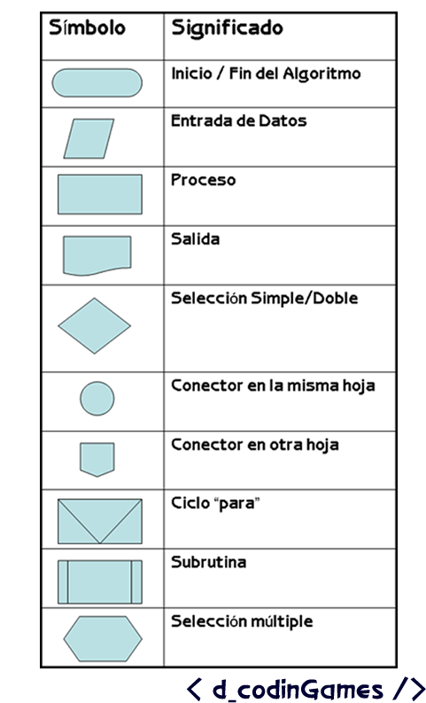
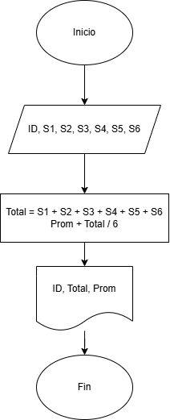
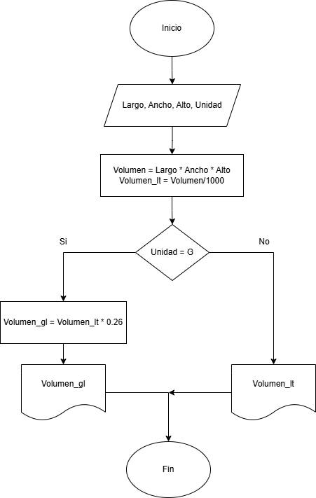
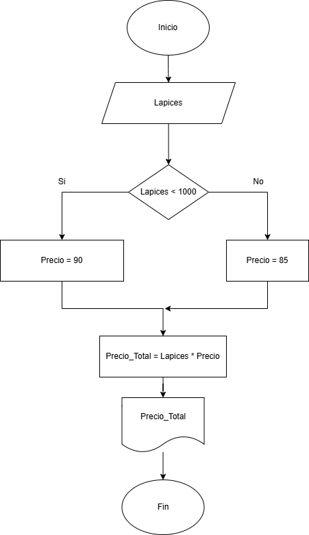
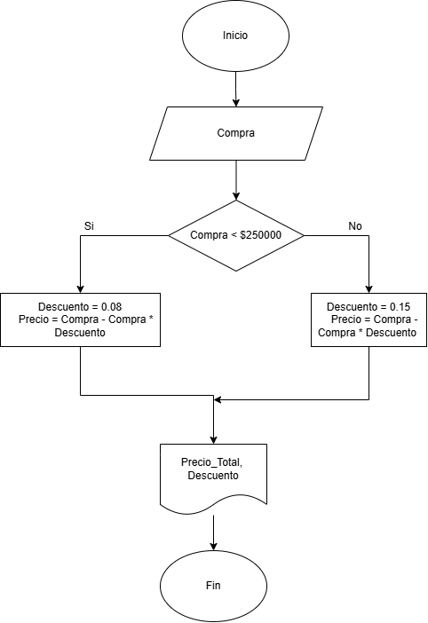
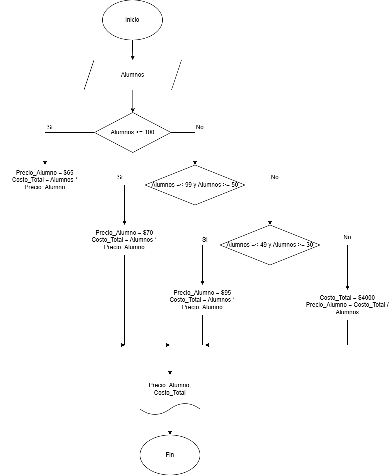

# Actividad 2

## Ejercicio 1  
  
Investiga cuáles son los símbolos que se utilizan para representar cada operación de un algoritmo con un diagrama de flujo. Asegúrate de que la fuente es confiable, discute lo que encontraste con tus compañeros y con el profe. Cuando estés seguro/a de tener los símbolos correctos, consigna la información en la bitácora.

### Símbolos  
  
  

## Ejercicio 2  
  
Analicemos el siguiente problema y representemos su solución mediante un algoritmo secuencial.  
  
- Construye un algoritmo que, al recibir como datos **el ID** del empleado y los seis primeros sueldos del año, calcule el ingreso total semestral y el promedio mensual, e imprima el ID del empleado, el ingreso total y el promedio mensual.  
  
Entradas:  
|Nombre|Descripción|
|-|-|  
|ID|Identificador del empleado (numérico)|  
|S1, S2, S3, S4, S5, S6|Los sueldos de los 6 meses (numérico)|  
  
Datos intermedios:
|Nombre|Descripción|  
|-|-|  
  
Salidas:
|Nombre|Descripción|  
|-|-|  
|Prom|Promedio mensual|
|Total|Ingreso total|
|ID| |  

### Pseudocódigo:  

Inicio  
Leer ID, S1, S2, S3, S4, S5, S6  
Total = S1 + S2 + S3 + S4 + S5 + S6  
Prom + Total / 6
Mostrar ID, Total, Prom  
Fin  

### Diagrama de flujo

## Ejercicios  
  
1. Un **acuario** necesita determinar cuántos litros o galones (eso lo decide el usuario) de agua caben en un acuario, pero solo dispone de una cinta métrica (en centímetros). Diseña un algoritmo para solucionar el problema.  
  
Entradas:  
|Nombre|Descripción|
|-|-|  
|Largo|Largo del tanque en cm|  
|Ancho|Ancho del tanque en cm|  
|Alto|Alto del tanque en cm| 
|Unidad|Unidad de medida (Litro o galón) del volumen total| 
  
Datos intermedios:
|Nombre|Descripción|  
|-|-|  
  
Salidas:
|Nombre|Descripción|  
|-|-|  
|Volumen_lt|Volumen total del tanque en litros|  
|Volumen_gal|Volumen total del tanque en galones|   

### Pseudocódigo:  
  
Inicio  
Mostrar “Por favor ingrese las medidas del tanque”  
Leer Largo, Ancho, Alto  
Mostrar “Ingres L para litros y G para galones”  
Leer Unidad  

Volumen = Largo * Ancho * Alto  //en Mililitros  
Volumen_lt = Volumen/1000  //en Litros  

Si Unidad = “G” 

    Volumen_gl = Volumen_lt * 0.26  
    Mostrar Volumen_gl  

Si no 

    Mostrar Volumen_lt 

Fin Si 

Fin

### Diagrama de flujo

  

2. Realice un algoritmo para determinar cuánto se debe pagar por equis cantidad de lápices considerando que si son 1000 o más el costo es de $85 cada uno; de lo contrario, el precio es de $90. Represéntelo con el pseudocódigo y el diagrama de flujo.  

Entradas:  
|Nombre|Descripción|
|-|-|  
|Lapices|Cantidad de lapices|  

Datos intermedios:
|Nombre|Descripción|  
|-|-|  
|Precio|Precio de cada lápiz|  
  
Salidas:
|Nombre|Descripción|  
|-|-|  
|Precio_Total|Precio total de la compra|  

### Pseudocódigo:  
  
Inicio  
Leer Lapices  
si Lapices < 1000  

    Precio = 90

si no

    Precio = 85

Fin si  
Precio_Total = Lapices * Precio  
Mostrar Precio_Final  
Fin  

### Diagrama de flujo

  

3. Un almacén de ropa tiene una promoción: por compras superiores a $250 000 se les aplicará un descuento de 15%, de caso contrario, sólo se aplicará un 8% de descuento. Realice un algoritmo para determinar el precio final que debe pagar una persona por comprar en dicho almacén y de cuánto es el descuento que obtendrá. Represéntelo mediante el pseudocódigo y el diagrama de flujo.  

Entradas:  
|Nombre|Descripción|
|-|-|  
|Compra|El precio de la compra hecha|  

Datos intermedios:
|Nombre|Descripción|  
|-|-|  
  
Salidas:
|Nombre|Descripción|  
|-|-|  
|Precio|Precio total después de aplicar el descuento|  
|Descuento|Descuento aplicado|

### Pseudocódigo:  
  
Inicio  
Leer Compra  
si Compra < $250000  

    Descuento = 0.08
    Precio = Compra - Compra * Descuento  

si no

    Descuento = 0.15
    Precio = Compra - Compra * Descuento  

Fin si  
Mostrar Precio, Descuento   
Fin  

### Diagrama de flujo

  

4. El director de una escuela está organizando un viaje de estudios, y requiere determinar cuánto debe cobrar a cada alumno y cuánto debe pagar a la compañía de viajes por el servicio. La forma de cobrar es la siguiente: si son 100 alumnos o más, el costo por cada alumno es de $65.00; de 50 a 99 alumnos, el costo es de $70.00, de 30 a 49, de $95.00, y si son menos de 30, el costo de la renta del autobús es de $4000.00, sin importar el número de alumnos.  

Entradas:  
|Nombre|Descripción|
|-|-|  
|Alumnos|Numero de alumnos|  

Datos intermedios:
|Nombre|Descripción|  
|-|-|  
  
Salidas:
|Nombre|Descripción|  
|-|-|  
|Precio_Alumno|Precio que cada alumno debe de pagar|  
|Costo_Total|Costo total del viaje|

### Pseudocódigo:  
  
Inicio  
Leer Alumnos  
si Alumnos >= 100  

    Precio_Alumno = $65
    Costo_Total = Alumnos * Precio_Alumno  

si no
    si Alumnos =< 99 y Alumnos >= 50  

        Precio_Alumno = $70
        Costo_Total = Alumnos * Precio_Alumno
    
    si no
        si Aumnos =< 49 y Alumnos >= 30  

            Precio_Alumno = $95
            Costo_Total = Alumnos * Precio_Alumno

        si no
            Costo_Total = $4000
            Precio_Alumno = Costo_Total / Alumnos
        Fin si
    
    Fin si

Fin si  
Mostrar Precio_Alumno, Costo_Total   
Fin  

### Diagrama de flujo

  

# Bucles o ciclos

## Ejemplo 1

Inicio  
SU = 0   
VA = 0
Mientras VA != -1 
     Leer VA  
     SU = SU + VA    
Fin mientras  
Escribir SU  
Fin  

## Ejemplo 2

Inicio  
Desde N = 5 Hasta N = 5000
N = N + 5

    Mostrar N

Fin

### Ejercicio 4

Inicio
Leer N
C = 0
Cero = 0
Mayores = 0
Menores = 0

Mientras N >= 0

    Leer C
    si C = 0

        Cero = Cero + 1
    
    si no
        si C > 0

            Mayores = Mayores + 1
    
        si no

            Menores = Menores + 1
        
        Fin si

    Fin si

    N = N - 1

Fin Mientras

Mostrar Cero, Mayores, Menores
Fin

# Actividad de Evaluación: Comprensión de Conceptos

### Parte 1: Identificar Algoritmos

Responde si los siguientes enunciados representan un algoritmo. Justifica la respuesta:

1. Una página web.
2. Una receta para hacer un pastel, donde se indican ingredientes y pasos a seguir.
3. "Piensa en un número y multiplícalo por otro".
4. Un manual de instrucciones para armar un mueble, con pasos detallados y un orden claro.
5. Una lista de compras organizada en orden alfabético

## Respuestas  

1. No es un algoritmo; se pueden ejecutar algoritmos dentro de ella, pero como tal una pagina web no esta realizando ninguna serie de pasos de por si.
2. si, se está realizando una serie de pasos, con un orden especifico y organizado.
3. No, no se esta realizando un proceso claro de pasos.
4. Si, se esta realizando un proceso organizado paso a paso, y con instrucciones claras para cumplir la tarea.
5. No, solo se esta mencionando una lista, pero no se esta realizando ningún proceso con ella.

### Parte 2: Variables y Constantes

Indica si las siguientes afirmaciones describen una variable o una constante:

1. El valor de la gravedad en la Tierra, 9.8 m/s².
2. La edad de una persona calculada con base en el año actual y su año de nacimiento.
3. La cantidad de dinero en una cuenta bancaria.
4. La velocidad de la luz en el vacío, 299,792,458 m/s.
5. El radio de un círculo.

## Respuestas  
  
1. Constante
2. Variable
3. Variable
4. Constante
5. Variable

### Parte 3: Características de los Algoritmos

Responde si los siguientes enunciados cumplen con las características de un algoritmo. Justifica la respuesta:

1. Para elegir la ruta más corta entre varias ciudades, el algoritmo examina rutas candidatas, deteniéndose cuando los cambios en la distancia parecen lo suficientemente pequeños.
2. Suma los números ingresados y muestra el resultado.
3. Un conjunto de pasos para calcular el área de un rectángulo dado su base y altura.
4. El algoritmo cuenta el número de votos obtenidos por cada uno de los candidatos de una elección para presidente. Empieza solicitando el nombre del candidato y finaliza cuando se ingresa el valor -1.  

### Respuestas

1. No, el procedimiento de como son los pasos para elegir la ruta más corta no es claro ni detallado y no se distingue un orden especificio de como son los pasos que el algoritmos sigue.
2. No, el algoritmo no esta bien definido, por lo que resultan habiendo ambiguedades como cuantos numeros deben de ser ingresados, o a que conjunto deben de pertenecer los numeros. Falta exactitud.
3. Si, el algoritmo contiene los pasos detallados y el objetivo final al que se debe de llegar.
4. Si, el algoritmo cuenta con unos pasos claros, los cuales definen lo que se debe de realizar en cada parte del procedimiento. Cuenta con inicio y fín.

### Parte 4: Comprensión de Herramientas

Indica si las siguientes afirmaciones son ciertas o falsas respecto al pseudocódigo y diagramas de flujo:

1. El pseudocódigo utiliza símbolos estándar para representar las operaciones lógicas.
2. Los diagramas de flujo son una representación gráfica de un algoritmo.
3. El pseudocódigo debe estar escrito en un lenguaje de programación específico.
4. Un diagrama de flujo siempre debe tener un inicio y un fin claramente definidos.

### Respuestas  

1. No, el pseudocódigo utiliza palabras comunes y cotidianas del lenguaje.
2. Si, se utilizan diferentes símbolos, los cuales muestran el orden de los pasos de manera gráfica.
3. No, el pseudocódigo debe de estar escrito en un lenguaje común y no se deben de utilizar palabras técnicas.
4. Si, el diagrama de flujo tiene simbolos designados para mostrar el inicio y el fin del algoritmo.

### Parte 5: Estructuras de Control

Describe para qué sirven las estructuras de control. Redacta dos ejemplos, uno de tu vida diaria, es decir cuando tienes que tomar decisiones en tus actividades diarias y oto ejemplo en el que se tengan que utilizar cálculos matemáticos para tomar una u otra decisión.

### Respuesta

Las estructuras de control determinan el orden y flujo de ejecución de las instrucciones en un algoritmo. Existen dos tipos de estructuras de control: En primer lugar existen las estructuras secenciales, las cuales definen una secuencia lineal donde se ejecutan los pasos uno tras el otro. En segundo lugar existen las estructuras selectivas, las cuales se encargan de tomar desiciones.   

Ejemplo 1 (Vida cotidiana): Desde el primer momento del dia donde suena la alarma, debemos de tomar la desicion de si queremos seguir durmiendo o si levantarse y emprender con las actividades del día.  

Ejemplo 2 (Cálculos matemáticos): Supongamos que debo de calcular el impuesto aplicado a un producto, pero este depende del precio del producto. En este caso, primero debo de analizar cual es el precio del producto, y acorde con esto, determinar cual debe de ser el impuesto aplicado.