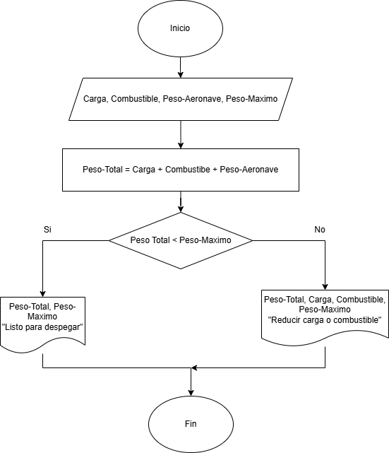

# Taller de Algoritmos  

### **Ejercicios con condicionales**

1. **Verificación de peso de despegue**
    
    En una pista de pruebas de aeronaves, el sistema debe verificar si el peso total de la aeronave, incluyendo combustible y carga, supera el límite máximo permitido para el despegue. Dependiendo del resultado, el sistema deberá indicar si la aeronave está lista para despegar o si debe reducir carga o combustible.  

### Diagrama de flujo: 

  

### **Ejercicios con bucles**

4. **Control de combustible en pruebas**
    
    Durante un ensayo en banco de un motor a reacción, se mide el nivel de combustible cada minuto y se detiene el registro cuando el combustible baja del 10%. Mostrar el tiempo total de operación antes de llegar a ese punto.

    ### Respuesta:  

    Entradas:  
    |Nombre|Descripción|  
    |-|-|
    |Combustible|Es el dato que nos da el sensor acerca de la cantidad de combustible|
    |Capacidad|La capacidad maxima de combustible del tanque|

    Salidas:  
    |Nombre|Descripción|  
    |-|-|
    |Combustible||

    Variables de control:  
    |Nombre|Descripción|  
    |-|-|
    |Tiempo|El tiempo que ha transcurrido (Contador)|

    Constantes:

    Limite

    Pseudocódigo:

    Inicio

    Leer Capacidad, Combustible  

    Limite = 0.1  
    Tiempo = 0  

    Mientras Combustible > Capacidad * Limite

        Leer Combustible

        Tiempo = Tiempo + 1

    Fin Mientras

    Mostrar Combustible, Tiempo  

    Fin

### **Ejercicios con bucle y condicionales**
    
6. **Control de temperatura en cabina**
    
    Un sistema mide cada 5 minutos la temperatura en cabina durante una hora. Si en algún momento se detecta una temperatura mayor a 27°C o menor a 18°C, debe indicar que se active el sistema de climatización.

### Respuesta  

    Entradas:  
    |Nombre|Descripción|  
    |-|-|
    |Temperatura|Es la medida de la temperatura de la cabina|

    Variables de control:  
    |Nombre|Descripción|  
    |-|-|
    |Repeticiones|Cantidad de veces que se mide la temperatura (Contador)|

    Constantes:

    Temperatura Máxima
    Temperatura Mínima

    Pseudocódigo:

    Inicio

    Leer Temperatura  

    Temperatura Máxima = 27
    Temperatura Mínima = 18

    Desde  Repeticiones = 0 hasta Repeticiones <= 12

        Repeticiones = Repeticiones + 1

        Leer Temperatura

        Si Temperatura > Temperatura Máxima

            Mostrar "Temperatura alta, activar sistema de climatización"

        Si no

            Si Temperatura < Temperatura Mínima

                Mostrar "Temperatura baja, activar sistema de climatización"

            Fin Si

        Fin si

    Fin Desde

    Fin
